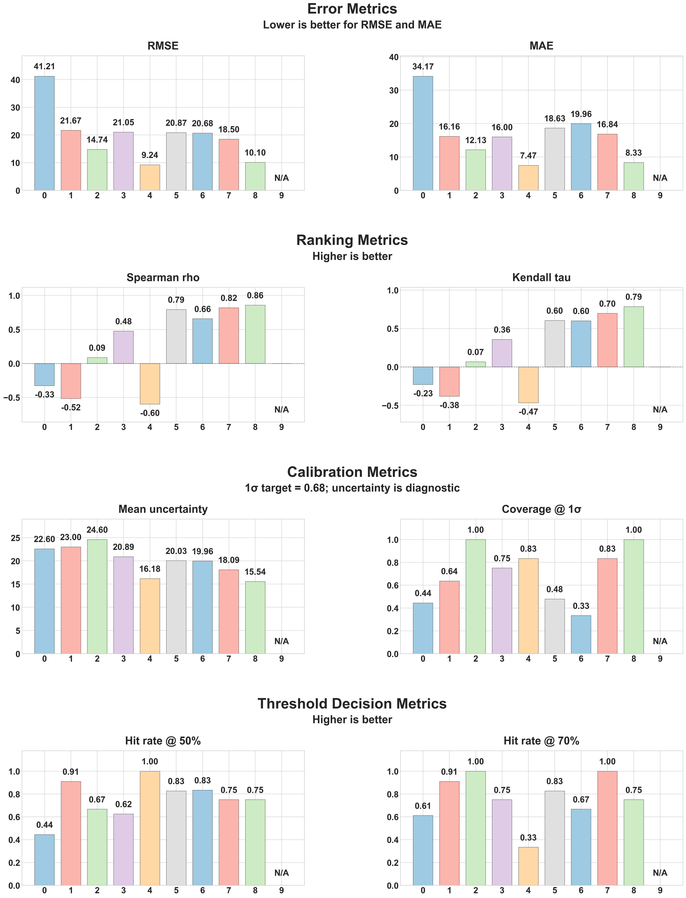
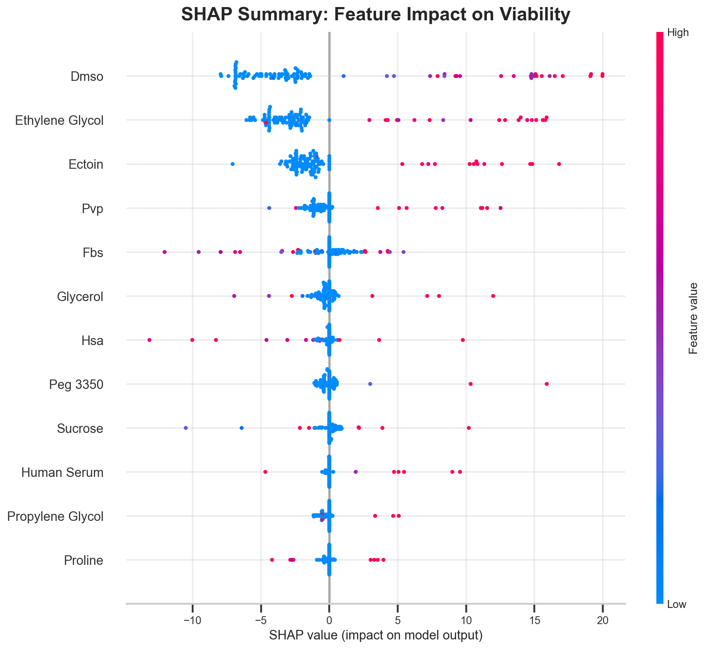
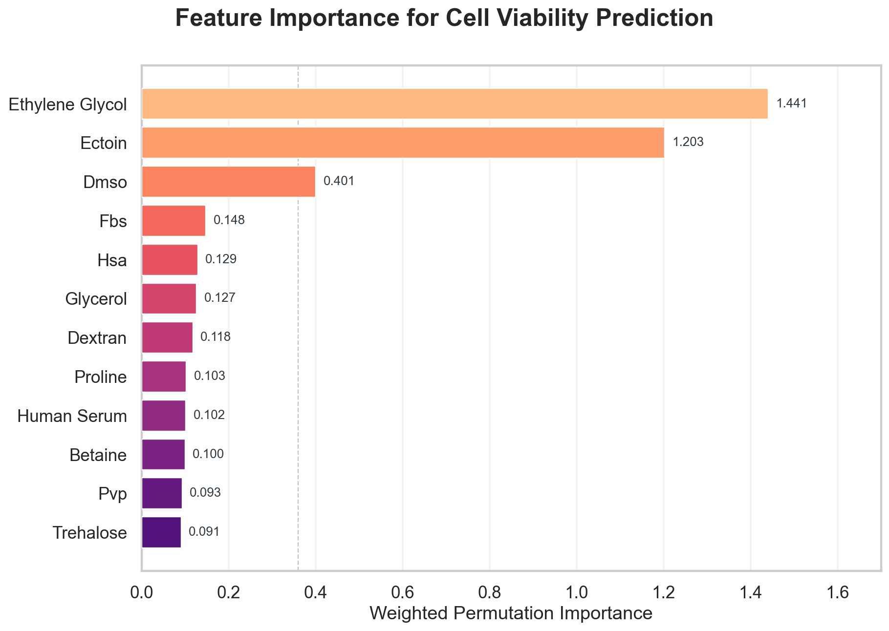
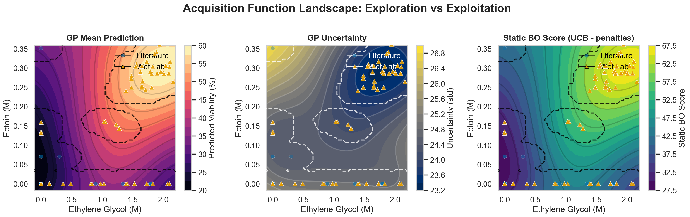
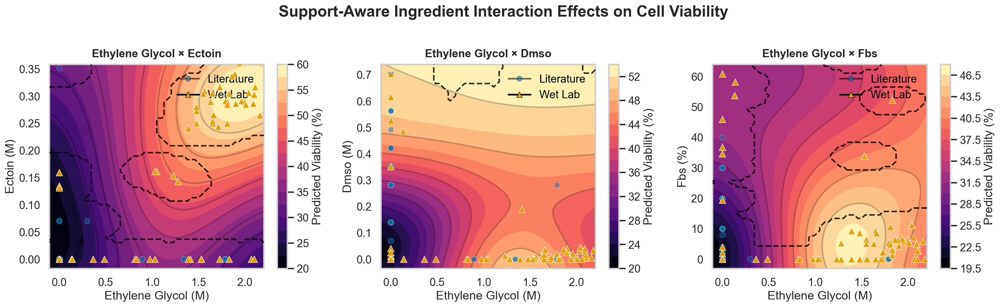
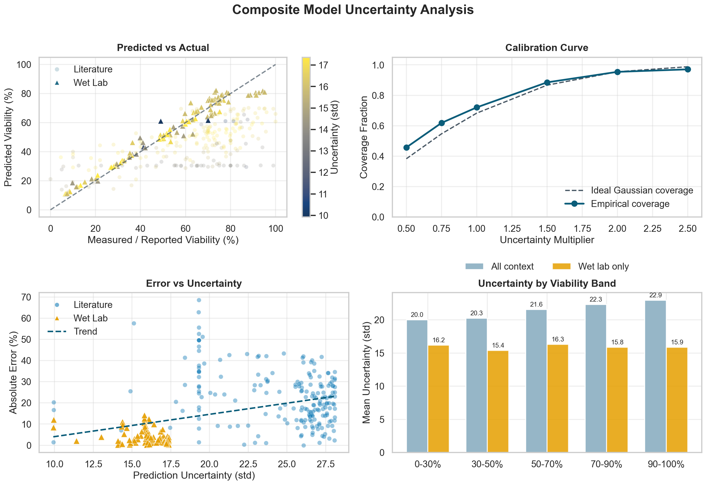
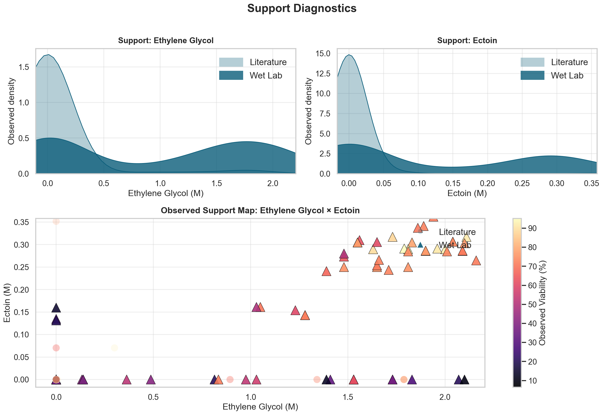

# CryoMN ML-Based Cryoprotective Solution Optimization

Machine learning pipeline for optimizing cryoprotective formulations for cryomicroneedle (CryoMN) technology.

Repository checkpoint artifacts referenced below use stage-tagged iteration directories such as `iteration_10_prior_mean`.

## Goals

Legacy viability-only lane:

1. **Minimize DMSO usage** to reduce toxicity.
2. **Maximize MSC post-thaw viability**.
3. **Limit ingredient burden** during formulation search.

V2 multi-objective lane:

1. **Maximize MSC post-thaw viability**.
2. **Maximize CryoMN critical axial load per needle**.
3. **Gate candidates by intact patch formation** before mechanical testing.
4. **Use initial stiffness as a diagnostic endpoint**, not a Pareto objective.

---

## Workflow Overview

Project workflow with planning and implementation phases under human oversight:


---

## Approach

**Gaussian Process Regression + Bayesian Optimization**
- Works well with limited data (~200 samples)
- Provides uncertainty quantification
- Supports iterative refinement with wet lab validation

## Which Workflow To Use

| Lane | Use when | Main entry point |
|------|----------|------------------|
| Legacy viability-only | Reproduce the manuscript viability pipeline and prior BO outputs. | `src/01_data_parsing` through `src/07_next_formulations` |
| V2 multi-objective | Run the new viability + CryoMN mechanical robustness loop. | `src/08_multi_objective` |

The current implementation work is concentrated in the v2 lane. Its detailed
workflow documentation lives in `src/08_multi_objective/README.md`, with one
README in each numbered stage folder.

## Quick Start: V2 Multi-Objective Loop

```bash
# 1. Build the v2 database from legacy viability evidence
python3 src/08_multi_objective/01_build_database/build_database.py

# 2. Generate the full scored pool and the 12-row wet-lab slate
python3 src/08_multi_objective/02_select_candidates/select_candidates.py

# 3. After wet lab, fill the current next_round_candidates.csv, then run the
# full round step: review current state, ingest, review updated state, generate
python3 src/08_multi_objective/03_run_round/run_round.py \
  results/multi_objective_v2/next_round/next_round_candidates.csv
```

V2 files to know:

| File | Meaning |
|------|---------|
| `data/processed_v2/formulations.csv` | Persistent formulation table. |
| `data/processed_v2/observations.csv` | Persistent endpoint observation table. |
| `results/multi_objective_v2/total_candidate_pool.csv` | Full generated/scored candidate pool for audit. |
| `results/multi_objective_v2/next_round/next_round_candidates.csv` | Current 12-row wet-lab sheet to fill. |
| `results/multi_objective_v2/next_round/next_round_summary.txt` | Human-readable validation summary. |
| `config_v2/availability.yaml` | Temporary ingredient availability restrictions. |
| `config_v2/optimization.yaml` | Candidate-pool size, penalties, and noise settings. |

`next_round_candidates.csv` is overwritten each Stage 02 run. The batch ID is
generated from `observations.csv`: after Stage 03 ingests `ROUND_001`, the next
Stage 02 run emits `ROUND_002`.

New validation viability feedback defaults to `1.0` observation noise, one fifth
of the legacy wet-lab viability noise. Change this in
`config_v2/optimization.yaml` or pass `--viability-noise` to Stage 03 for a
single import.

The v2 lane treats prior data as viability-only evidence, uses
`intact_patch_formation_pass` as the mechanical screening gate, and optimizes
viability with `critical_axial_load_N_per_needle`.
Exact BoTorch qLogNEHVI support uses the optional packages listed in
`requirements-v2-optional.txt`; if those are unavailable, the executable
fallback mode is reported in `next_round_summary.txt`.

## Quick Start: Legacy Viability Pipeline

```bash
# Install dependencies
pip install -r requirements.txt

# 1. Parse formulation data
python src/01_data_parsing/parse_formulations.py

# 2. Train GP model
python src/02_model_training/train_gp_model.py

# 3. Generate candidates
python src/03_optimization/optimize_formulation.py      # Fast random sampling, iteration-aware
python src/05_bo_optimization/bo_optimizer.py          # Proper BO with DE

# 4. Integrate wet lab results (after experiments)
python src/04_validation_loop/update_model.py
python src/04_validation_loop/update_model_weighted_simple.py
python src/04_validation_loop/update_model_weighted_prior.py

# 5. Explain model predictions (auto-detects composite model)
python src/06_evaluation_explainability/explainability.py

# 6. Evaluate frozen stages against their wet-lab batches
python src/06_evaluation_explainability/evaluate_iterations.py

# 6b. Generate stage-indexed wet-lab R² plots (default: prospective cumulative)
python src/06_evaluation_explainability/stage_r2_predicted_vs_actual.py

# 7. Generate the next 20-formulation wet-lab batch
python src/07_next_formulations/next_formulations.py

```

> [!CAUTION]
> `python src/05_bo_optimization/bo_optimizer.py` is a long-running optimization step. It evaluates repeated Differential Evolution searches for both general and low-DMSO candidate batches, and it prints live DE-search status while the script is running.

## Repository Snapshot

Snapshot date: `2026-04-22` (checkpoint: `iteration_10_prior_mean`).

| Metric | Snapshot value |
|--------|---------------|
| Wet-lab validation rows | 106 |
| Latest wet-lab batch date in snapshot | 2026-04-21 |
| Best validated viability | 95.15% |
| Best validated formulation | 21.0mM DMSO + 291.1mM ectoin + 1.79M ethylene glycol + 5.4% FBS |
| Mean wet-lab viability | 52.26% |
| Median wet-lab viability | 57.45% |
| Wet-lab runs at or above 50% viability | 63 |

The snapshot highlights the ectoin + ethylene glycol ridge with FBS-augmented
variants. The residual-driven `07_next_formulations` step targets blind spots
from completed wet-lab stages.

## Active Model and Iterations

- `src/04_validation_loop/*` saves each retrained checkpoint under `models/iteration_*`, updates `data/validation/iteration_history.json`, and then replaces the active root metadata in `models/model_metadata.json` with an explicit overwrite notice.
- `src/03_optimization/optimize_formulation.py`, `src/05_bo_optimization/bo_optimizer.py`, and `src/06_evaluation_explainability/explainability.py` share the same iteration-aware resolver.
- `src/04_validation_loop/*` also writes a canonical observed-context artifact to `models/<iteration_dir>/observed_context.csv` and mirrors the active copy to `models/observed_context.csv`.
- If root metadata is missing or inconsistent, these entry points prompt for an iteration number, reject nonsensical choices, and repair `models/model_metadata.json` only after telling you it is overwriting the metadata.
- Composite iterations are strict: if metadata says composite, the shared resolver will not fall back to a standard GP automatically.
- `03_optimization`, `05_bo_optimization`, and `06_evaluation_explainability` all load the same iteration-aware observed context, and reconstruct it from literature + validation inputs on demand if the artifact is missing.
- `05_bo_optimization` uses analytic wet-lab weights from the observed context when calibrating BO support geometry, instead of relying on literal duplicate rows.
- `04_validation_loop/update_model_weighted_prior.py` uses fixed source-level noise hyperparameters (`alpha_literature=1.0`, `alpha_wetlab=0.02`) and writes post-hoc calibration metadata (`bias_shift_percent`, `uncertainty_scale`, coverage diagnostics) into active model metadata.
- `05`, `06`, and `07` apply the same metadata-driven prediction calibration path so acquisition, evaluation, and next-batch selection are consistent.
- `03`, `05`, `06`, and `07` share a practical concentration floor for formulation identity: values below `0.1%` or below `1.0 mM` are treated as absent when generating candidates, matching hits, and rendering formulation strings.
- The repository does not rely on one permanent static train/test split. The update scripts estimate wet-lab generalization with K-fold cross-validation over wet-lab rows only, while retaining all literature rows in training for every fold.
- In code, the wet-lab fold count is `min(5, len(X_val))` with `shuffle=True` and `random_state=42`. In the saved iterations in this repo that behaves as 5-fold CV, because every completed wet-lab stage has at least 5 measured rows.
- For the standard update, each fold trains on `literature + wetlab_train_fold` and predicts the held-out wet-lab fold. The weighted-simple update uses the same split but duplicates the training-fold wet-lab rows, and the prior-mean update keeps the literature GP fixed while cross-validating only the wet-lab residual correction GP.

## Results Snapshot

### Wet-Lab Validation Signal

The best measured wet-lab result in this snapshot is:

- `95.15%` viability for `21.0mM DMSO + 291.1mM ectoin + 1.79M ethylene glycol + 5.4% FBS`

That same region remains the model's top BO target, which is a useful consistency check between prediction and validation.

### DE-Based Bayesian Optimization (`05_bo_optimization`)

General BO summary for this snapshot: `results/bo_candidates_general_iteration_10_prior_mean_summary.txt`

| Rank | Formulation | Predicted viability |
|------|-------------|---------------------|
| 1 | 284.8mM ectoin + 1.81M ethylene glycol + 4.9% FBS | 75.4% ± 12.4% |
| 2 | 11.0mM DMSO + 289.7mM ectoin + 1.81M ethylene glycol + 5.7% FBS | 75.0% ± 12.3% |
| 3 | 301.7mM ectoin + 1.87M ethylene glycol + 4.9% FBS + 120.7mM raffinose | 74.6% ± 12.6% |
| 4 | 284.8mM ectoin + 2.01M ethylene glycol + 5.4% FBS | 74.2% ± 12.4% |
| 5 | 21.0mM DMSO + 291.1mM ectoin + 1.79M ethylene glycol + 5.4% FBS | 74.2% ± 12.3% |

### Next Formulations (`07_next_formulations`)

The recommended next wet-lab batch comes from:

```bash
python src/07_next_formulations/next_formulations.py
```

This script:
- resolves the active iteration automatically
- requires validation coverage through stage `N-1` when targeting stage `N`
- uses `05` BO outputs as the exploitation source pool
- normalizes existing and newly generated candidates so trace ingredients below `0.1%` or `1.0 mM` are treated as absent
- chooses exploit/explore counts adaptively from the previous completed stage diagnostics (default `8/12`, bounded to exploit `4..12`, total always `20`)
- reserves 2 BO-only `coverage_probe` slots selected by greedy k-center distance from observed context
- adaptively relaxes the positive-residual anchor threshold when stronger anchors are unavailable
- fills the exploration remainder with local-rank and blind-spot probes using an adaptive local/blindspot target, then uses BO fallback only if needed
- fails by default if fewer than 2 coverage probes are feasible; `--allow-coverage-shortfall` allows fallback backfill with audit logging
- allows exploration probes to anchor from any historical positive-residual wet-lab stage
- writes recommended batch subsets for wet-lab capacities from 6 to 12 formulations
- validates inputs before generation and validates all 20 outputs again before writing

Outputs are written under `results/next_formulations/<iteration_tag>/`, for example:
- `results/next_formulations/iteration_10_prior_mean/next_formulations.csv`
- `results/next_formulations/iteration_10_prior_mean/next_formulations_summary.txt`
- `results/next_formulations/iteration_10_prior_mean/next_formulations_metadata.json`
- `results/next_formulations/iteration_10_prior_mean/input_validation.json`
- `results/next_formulations/iteration_10_prior_mean/batch_recommendations.json`
- `results/next_formulations/iteration_10_prior_mean/batch_recommendations.csv`

The summary and metadata artifacts record positive-residual thresholds,
selected threshold, exploration-row sources (local-rank probes, coverage
probes, blind-spot probes, BO fallback), and historical anchor stages for
generated probes. The text summary also
includes a human-readable version of each recommended batch subset for wet-lab
capacities from 6 through 12 formulations.

The batch recommendation `score` is a heuristic subset-selection score. It
ranks candidate subsets built from the 20-row slate and does not represent
predicted viability or expected improvement directly. Higher scores reflect a
better tradeoff among row utility, chemistry-family diversity, local-anchor
diversity, and closeness to the intended exploit / local-rank / blind-spot mix.

The per-row `utility` values shown in the text summary are the row-level inputs
to that subset score. They are also heuristic. A row's utility depends on its
role: exploitation rows emphasize predicted viability and confidence, while
exploration rows place more weight on uncertainty, blind-spot value, and
novelty.

### Stage-Based Evaluation

The repository includes a stage-based evaluator that scores each frozen
model output against the wet-lab batch it actually generated:

- standalone literature-only checkpoint in `models/literature_only/` plus outputs in `results/*` without an iteration suffix → `EXP101` to `EXP306`
- `iteration_1_*` outputs → `EXP1101` to `EXP1206`
- `iteration_2_*` outputs → `EXP2101` to `EXP2106`
- `iteration_3_*` outputs → `EXP3101` to `EXP3108`
- `iteration_4_*` outputs → `EXP4101` to `EXP4106`
- `iteration_5_*` outputs → wet-lab batches on 2026-03-24 and 2026-03-26
- `iteration_6_*` outputs → wet-lab batch on 2026-03-31
- `iteration_7_*` outputs → wet-lab batch on 2026-04-09
- `iteration_8_*` outputs → wet-lab batch on 2026-04-14
- `iteration_9_*` outputs → wet-lab batch on 2026-04-21
- `iteration_10_*` outputs → pending wet-lab results

Run:

```bash
python src/06_evaluation_explainability/evaluate_iterations.py
```

Outputs:

- `results/evaluation/iteration_prospective_summary.json`
- `results/evaluation/iteration_prospective_metrics.csv`
- `results/evaluation/stage_performance.png`
- `results/evaluation/next_formulations_performance.png`
- `results/evaluation/single_objective_progress.png`
- `results/evaluation/single_objective_progress_metrics.csv`
- `results/explainability/stage_r2/*.png` (from `stage_r2_predicted_vs_actual.py`)

Candidate-hit matching in `06_evaluation_explainability` uses the same
practical concentration floor, so frozen candidate rows count as hits in
subsequent wet-lab stages when the only difference is a trace ingredient below
`0.1%` or `1.0 mM`.

Stage-level metrics from the saved evaluation artifacts:

| Stage | Validation batch | Rows | RMSE | Spearman | Hit Rate @ 50% |
|------|-------------------|------|------|----------|----------------|
| Literature only | `EXP101-EXP306` | 18 | 41.21 | -0.327 | 0.444 |
| Iteration 1 | `EXP1101-EXP1206` | 11 | 21.67 | -0.518 | 0.909 |
| Iteration 2 | `EXP2101-EXP2106` | 6 | 14.74 | 0.086 | 0.667 |
| Iteration 3 | `EXP3101-EXP3108` | 8 | 21.05 | 0.476 | 0.625 |
| Iteration 4 | `EXP4101-EXP4106` | 6 | 9.24 | -0.600 | 1.000 |
| Iteration 5 | `2026-03-24, 2026-03-26` | 23 | 20.87 | 0.793 | 0.826 |
| Iteration 6 | `2026-03-31` | 6 | 20.68 | 0.657 | 0.833 |
| Iteration 7 | `2026-04-09` | 12 | 18.50 | 0.818 | 0.750 |
| Iteration 8 | `2026-04-14` | 8 | 10.10 | 0.857 | 0.750 |
| Iteration 9 | `2026-04-21` | 8 | 6.86 | 0.810 | 0.875 |
| Iteration 10 | pending wet-lab results | 0 | N/A | N/A | N/A |

Interpretation:

- absolute error improved sharply from the literature-only baseline, with best RMSE at iteration 4
- rank ordering strengthened materially in later stages, peaking so far in iterations 5 and 7
- hit rate at 50% remains high for recent completed stages (iterations 5 to 7)
- `07_next_formulations` uses stage residuals plus BO outputs to choose a mixed exploit/explore wet-lab batch

Stage-indexed wet-lab R² visuals are generated separately by:

```bash
python src/06_evaluation_explainability/stage_r2_predicted_vs_actual.py
```

The default mode is prospective cumulative (stage-indexed outputs in
`results/explainability/stage_r2/` through the latest completed stage).



---

## Model Explainability

Understanding which ingredients drive cell viability predictions is crucial for guiding wet lab experiments. The explainability module renders a support-aware visual suite: contour-style figures preserve the BO aesthetic, observed literature and wet-lab support are shown directly, and stronger-support regions are indicated with boundaries instead of masking the surfaces.

### Explainability Outputs (`iteration_10_prior_mean`)

The explainability outputs shown here live in `results/explainability/iteration_10_prior_mean/`. The suite emphasizes top drivers such as `ethylene_glycol`, `dmso`, `ectoin`, `fbs`, and `hsa`, while making the support envelope explicit.

`explainability.py` focuses on support-aware interpretability visuals.
`stage_r2_predicted_vs_actual.py` generates wet-lab R² scatter plots.

#### SHAP Summary



The SHAP summary is intentionally limited to the top features. Point color encodes feature value and horizontal spread shows the direction and magnitude of each feature's contribution across observed formulations.

#### Feature Importance



In the feature-importance chart, the dashed vertical line is only a visual dominance cutoff separating the strongest drivers from the long tail; it is not a hard selection threshold.

#### Acquisition Landscape

The acquisition landscape defaults to **Upper Confidence Bound (UCB)** and mirrors the `05` BO visual language. The static score view includes support and sparsity penalties, while dashed support boundaries indicate where the pair is better grounded in observed data:



#### Interaction Contours

Visualizing how pairs of top ingredients interact to affect viability, with observed-point overlays and dashed support boundaries:



Across the support-aware figures, the dashed white boundary marks the stronger pairwise support envelope inferred from observed formulations. Inside that boundary, the surface is better anchored by observed data; outside it, the same surface is rendered for continuity but should be read as more extrapolative.

#### Uncertainty Analysis



#### Support Diagnostics

This companion diagnostic shows where the top features and top pair are actually supported by literature and wet-lab observations:



For detailed interpretation and additional visualizations, see [`src/06_evaluation_explainability/README.md`](src/06_evaluation_explainability/README.md).

---

## Project Structure

```
├── data/
│   ├── raw/                    # Original literature data
│   ├── processed/              # Parsed formulations + prior-mean evaluation mirror
│   └── validation/             # Wet lab results template
├── models/                     # Active model mirror + per-iteration checkpoints + observed context
├── results/                    # Optimized candidates + explainability + evaluation graphs
└── src/
    ├── 01_data_parsing/        # Parse CSV, normalize units, merge synonyms
    ├── 02_model_training/      # Train GP regression model (Matérn kernel)
    ├── 03_optimization/        # Random sampling + GP prediction (fast)
    ├── 04_validation_loop/     # Integrate wet lab feedback, retrain model
    ├── 05_bo_optimization/     # Proper BO with Differential Evolution
    ├── 06_evaluation_explainability/  # Stage evaluation + explainability plots
    └── 07_next_formulations/   # Build the next 20-formulation wet-lab batch
```

## Module Descriptions

| Module | Method | Best For |
|--------|--------|----------|
| `01_data_parsing` | Data Parsing & Normalization | Preparing clean, structured training data from raw literature |
| `02_model_training` | Gaussian Process Regression (Matérn Kernel) | Learning the viability landscape from limited data |
| `03_optimization` | Random sampling, iteration-aware model loading | Quick generation, metadata repair when active model state is inconsistent |
| `04_validation_loop` | Three update strategies + iteration checkpointing + shadow method comparison helpers | Closing the active learning loop with wet lab feedback and comparing candidate update methods without activation |
| `05_bo_optimization` | Differential Evolution with batched population scoring, wet-lab-aware BO context, shared iteration-aware model loading | Exploiting validated winners while proposing nearby informative variants |
| `06_evaluation_explainability` | Stage-based evaluation, recommendation-slate auditing, SHAP, PDPs, Interaction Contours, shared iteration-aware model loading | Measuring frozen-stage performance, auditing `07` outputs, and understanding model drivers |
| `07_next_formulations` | Strict next-batch generation from BO outputs + residual blind spots + adaptive exploit/explore split + smaller-batch subset recommendation | Selecting exactly 20 future wet-lab formulations with diagnostics-driven exploit/explore counts and recommending subsets for batch sizes 6 through 12 |

## Key Features

- **34 ingredients** tracked (DMSO, trehalose, glycerol, FBS, PEG by MW, etc.)
- **PEG molecular weight handling**: Individual tracking of PEG 400, 600, 1K, 3350, 5K, 10K, 20K, etc.
- **Dual unit handling**: Molar (`_M`) for CPAs, Percentage (`_pct`) for sera/polymers
- **Synonym merging** (e.g., FBS = FCS = fetal bovine serum)
- **Unit normalization** (concentrations converted to molar or kept as percentage)
- **Uncertainty quantification** (GP provides confidence intervals)
- **Iterative refinement** (model improves with each wet lab validation)
- **Iteration-aware recovery** (`03` can repair missing/conflicting active metadata interactively)
- **Explainable AI** (SHAP and partial dependence plots to interpret Black Box GP)
- **Two optimization modes**: Fast random sampling OR proper Bayesian optimization
- **Canonical observed context** (`04` writes `observed_context.csv`; `03`, `05`, and `06` all consume the same active iteration view)
- **Wet-lab-aware BO** (`05` uses weighted observed context and seeds from top observed formulations)
- **Vectorized DE scoring** (`05` evaluates each DE population in batches so GP prediction and penalty calculations are not repeated point-by-point)
- **Metadata-driven calibration** (`04` fits with fixed alpha assumptions, then learns `bias_shift_percent` and `uncertainty_scale`; `05/06/07` consume the same calibrated prediction path)
- **Strict next-batch planning** (`07` validates inputs, generates calibration probes from residual blind spots, and writes traceable next-batch artifacts)
- **Adaptive exploit/explore policy** (`07` retunes exploit/explore counts from recent residual and coverage diagnostics while keeping total batch size fixed at 20)
- **Subset recommendation for limited wet-lab capacity** (`07` writes exact best-subset recommendations for batch sizes 6 through 12)
