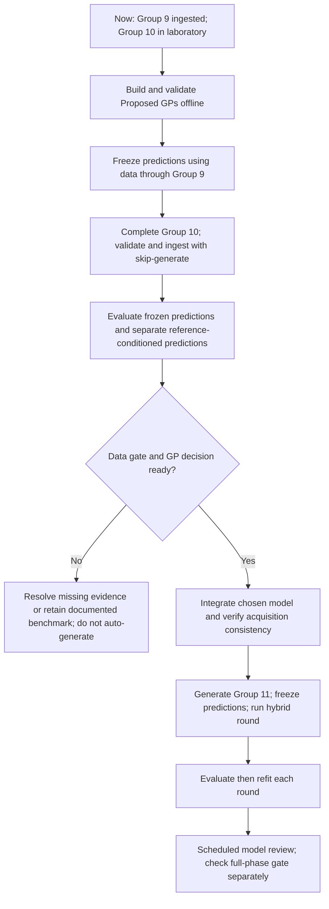

# Group 10 to hybrid: sequential GP decision plan

Status: sequence retained; implementation now available. See [operating guide](gp_strategy_implementation.md). Original planning state, 2026-09-16. Group 9 is ingested; Group 10's proposal is
frozen and its wet-lab work is underway. This document deploys no Proposed GP.

## Model names

- **Current GP:** existing endpoint prediction models; viability uses eligible literature
  and campaign observations with fixed Matérn-2.5 settings and supplied observation noise.
- **Proposed GP — campaign-only:** campaign viability and eligible retests; initially
  match Current GP settings to isolate source treatment.
- **Proposed GP — campaign-only + batch effect:** those observations plus biological batch
  IDs; add partially pooled batch offsets and separately modeled residual noise.
- **Proposed GP — campaign-only + batch effect + control calibration:** same, plus
  separately modeled viability-control observations, with a reference baseline.

Both batch-effect Proposed GPs are hierarchical mixed-effects models. Both retain
absolute viability measurements. Control calibration is an extension, not a different
statistical category. No viability control is introduced into mechanical modeling.

## Current workflow versus proposed additions

Current ingestion validates and stores measurements, archives the completed worksheet,
creates descriptive/CV/frozen-prediction prospective reports, and normally invokes the
next candidate-generation stage. Candidate generation fits Current GP anew from the
eligible accumulated data. Fixed kernel settings stay fixed, while conditioning data,
input standardization and target normalization change. The mechanics acquisition branch
fits a separate paired-output model. There is no deployed batch-offset/control calibration
model and no multi-model prospective freezing workflow for these new Proposed GPs.

Existing prospective reports already evaluate frozen predictions. The additions are
explicit batch components, whole-biological-batch validation, several separately frozen
challengers, reference-conditioned evaluation, and a recorded model decision. The
methodology decision is now enforced for Group 11 onward; use --skip-generate at Group 10 ingestion.
BoTorch acquisition failure now hard-stops instead of invoking a heuristic proxy.

## Sequential procedure

| State / time | Computational work | User action or decision | Exit condition |
|---|---|---|---|
| NOW: Group 9 ingested, Group 10 frozen and in the lab | Audit biological batch IDs, eligible repeated recipes, control availability and replicate units. Keep frozen Group 10 intact. | Confirm which measurements share a cell preparation; identify control/retest roles and whether Group 10 outcomes have already been viewed. No extra control slots. | Usable grouping and explicit data cut-off |
| NOW, before using Group 10 outcomes | Implement the four models above offline, with matched kernel/scaling assumptions. Test synthetic known batch shifts, uncertainty, exclusions and held-out batch behavior. Run historical forward validation. | Agree a small fixed comparison set and priorities: per-batch bias, error, within-batch ranking, interval coverage/width and stability. | Tested offline implementation and fixed comparison protocol |
| BEFORE Group 10 outcome access | Fit on eligible data through Group 9; save Group 10 means, intervals, model settings, training hashes and timestamp. Define reference-conditioned evaluation subset in advance. | Declare whether outcomes have already influenced development. If yes, classify Group 10 comparison as retrospective and freeze genuinely prospective predictions for Group 11. | Immutable predictions and honest evaluation label |
| WHEN Group 10 laboratory work finishes | Validate raw mechanics, endpoint comparability, loading counts and completed worksheet; ingest with --skip-generate. Evaluate original frozen Current GP predictions and eligible frozen Proposed GP predictions. | Supply actual results and QC information; retain measured values. | Validated ingestion; next proposal not yet generated |
| AFTER ingestion, BEFORE selecting Group 11 | Update only the held-out batch offset using designated control/retest values for the conditioned comparison; score remaining outcomes. Report all evaluated subsets explicitly. Refit all shortlisted models through Group 10 for future use after evaluation. | Review gains versus uncertainty. Do not use reference observations as independent test outcomes after conditioning on them. | Unconditioned and conditioned comparisons kept separate |
| HYBRID DECISION CHECKPOINT | Verify 8 eligible pairs, 6 distinct formulations, 2 batches. Expected after valid Group 10 ingestion: 8 pairs and 8 distinct formulations across Groups 9–10. Preserve ordinary evidence from the measured reference recipe. | Select viability source/batch strategy, mechanical GP settings, noise assumptions and acquisition architecture. If evidence is inconclusive, retain the documented benchmark or delay generation; do not auto-promote a challenger. | Recorded decision and passing data gate |
| BEFORE Group 11 generation | Implement chosen strategy in production, verify report/acquisition consistency and batch posterior semantics. For proposed shared bundle, use all eligible labels per endpoint; distinguish formulation-response from future-batch uncertainty. Enforce BoTorch hard-stop. | Approve scientific objective (average viability across batches initially), selection settings and any experimental acceptance thresholds used by selection. | Integration checks pass; configuration/version frozen |
| GROUP 11 generation and wet-lab execution | Generate hybrid slate; freeze production and shadow-model predictions. Four mechanical slots, no mechanically reserved viability-control slot. No alteration to Group 10. | Run planned experiments and record actual biological batch IDs. Use already planned retests as references; no mandatory new control. | Completed next round |
| EACH subsequent ingestion | Score frozen predictions before updating; refit chosen model with accumulated eligible data; archive each version. | Investigate QC or systematic failures; do not automatically switch models after one favorable round. | Updated data and auditable predictions |
| NEXT scheduled methodology review | Proposed timing: after Groups 11 and 12, or earlier for a concrete implementation/QC failure. Compare accumulated prospective evidence. Check full-phase gate separately: 16 pairs, 12 distinct formulations, 3 batches. | Retain or change strategy based on pooled and per-batch evidence; assess application success using prespecified thresholds separately. | Recorded review; no automatic claim of application readiness |

## Scarce-control policy

Use a single reference baseline shared across batches, not a freely fitted baseline in
each batch. Sparse controls imply uncertain calibration. A single control result cannot
by itself identify its long-run baseline and its batch shift. Existing retests may add
information; absent reliable reference history, show broad uncertainty or omit the
control-conditioned comparison. Do not invent reference observations or force an offset
from one noisy result. The reference model assumes some shared batch movement with
ordinary recipes; evaluate that assumption using the existing retests.

## What each prediction is for

Before-batch predictions support candidate selection and evaluation of performance on
unseen batches. Reference-conditioned predictions assess the value of available batch
information and interpretation of the other outcomes. If reference results arrive only
with the completed batch, conditioning is retrospective analysis and cannot improve the
already-executed selection. Batch-adjusted estimates do not replace raw outcomes or turn
failed acceptance thresholds into passes.

