# V2 Multi-Objective Architecture

This document describes only the V2 multi-objective CryoMN project. The legacy
single-objective project is a completed, read-only scientific reference. V2 may
read its CSV outputs during a deliberate database rebuild, but it does not edit
legacy files or import legacy runtime code.

The completed implementation, verification, and Section 4 problem mapping are
recorded in `REFACTOR_REPORT.md`; the corresponding machine-readable audit is
`REGRESSION_REPORT.json`.

## 1. What V2 optimizes

V2 has two quantities that the optimizer tries to maximize:

1. post-thaw viability, reported as percent;
2. critical axial load, reported as newtons per microneedle.

Intact-patch formation is a feasibility gate. In plain language, a formulation
is scientifically useful only if it can both preserve cells and form an intact
microneedle patch. Intact formation is therefore a pass/fail condition, not a
third objective. Initial stiffness is retained as a diagnostic mechanical
endpoint, not an optimization objective.

At the current Round 9 state, the database contains viability and intact-patch
measurements but no critical-load observations. The campaign is consequently in
`mechanics_bootstrap`: four of the twelve proposed formulations are assigned to
mechanical testing so that the second surrogate model can eventually be trained.
Zero-valued load predictions in this cold-start state mean “no trained
mechanical surrogate,” not a physical load measurement of zero.

## 2. Where the important data live

| Information | V2 location | Meaning |
|---|---|---|
| Formulation definitions | `data/processed_v2/formulations.csv` | One row per distinct formulation; ingredient concentrations are features. |
| Endpoint observations | `data/processed_v2/observations.csv` | Long-form viability, intact, and mechanical measurements with batch and replicate provenance. |
| Active wet-lab worksheet | `results/multi_objective_v2/next_round/next_round_candidates.csv` | The twelve proposed experiments plus blank result-entry columns. |
| Frozen proposal | `results/multi_objective_v2/rounds/ROUND_###/proposal/` | Immutable proposal, selection metadata, summary, and proposal figure. |
| Completed worksheet | `results/multi_objective_v2/rounds/ROUND_###/completed/` | The validated sheet that was actually ingested. |
| Round reports | `results/multi_objective_v2/rounds/ROUND_###/reports/` | Prospective validation and completed-round review artifacts. |
| Campaign report | `results/multi_objective_v2/reports/prospective/` | Evidence accumulated across completed rounds. |

The formulation table answers “what was made?” The observation table answers
“what happened when it was tested?” Keeping these separate prevents missing
mechanical measurements from being mistaken for measured zeros.

## 3. How one campaign round works

```mermaid
flowchart LR
    A[Read V2 tables and validated configuration] --> B[Resolve campaign phase]
    B --> C[Generate and filter candidate pool]
    C --> D[Predict and score candidates]
    D --> E[Select 12 viability/intact experiments]
    E --> F[Rank eligible mechanical tests]
    F --> G[Freeze proposal before experiments]
    G --> H[Enter wet-lab results]
    H --> I[Validate worksheet and mechanical eligibility]
    I --> J[Archive and ingest observations]
    J --> K[Generate prospective and campaign reports]
    K --> L[Generate next proposal in a subprocess]
```

The operator-facing sequence is:

1. Run Stage 2 to generate the proposal. Configuration is validated before the
   candidate pool or any output artifact is written.
2. Stage 2 freezes the proposal and copies a working sheet to `next_round/`.
3. Measure viability and intact formation for all twelve rows.
4. Perform mechanical tests only on intact-passing rows that have a numeric
   mechanical rank. Lower-numbered ranks are used first; backups fill failures.
5. Run Stage 3. It validates the completed sheet against the frozen proposal,
   archives it, appends long-form observations, and generates reports.
6. Stage 3 invokes Stage 2 as the existing separate process. The historical
   order remains ingest → archive/report → next proposal; this refactor does not
   introduce rollback semantics.

## 4. Where to change specific behavior

| Desired change | V2 file or module |
|---|---|
| Ingredient identity, unit, or bounds | `config_v2/ingredients.yaml` |
| Temporarily unavailable reagents | `config_v2/availability.yaml` |
| Objective and gate definitions | `config_v2/endpoints.yaml` |
| Phase gates, slate size, seed, and policy thresholds | `config_v2/optimization.yaml` |
| Prospective cohort definitions | `config_v2/evaluation.yaml` |
| Candidate-pool construction | `helper/candidates.py` |
| Surrogate training and prediction | `helper/models.py` |
| Prediction and acquisition scoring | `helper/selection_scoring.py` and `helper/acquisition.py` |
| Candidate eligibility and diversity rules | `helper/selection_constraints.py` |
| Twelve-row slate and mechanical allocation | `helper/selection_policy.py` |
| Stage 2 execution order and file promotion | `helper/candidate_workflow.py` |
| Scientific metric calculations | `helper/evaluation_metrics.py` |
| Matplotlib rendering | `helper/evaluation_plots.py` |
| V2 colors and typography | `helper/plot_theme.py` |
| Stable compatibility entry points | `helper/selection.py`, `helper/visualization.py`, and `helper/prospective_evaluation.py` |

The selection modules deliberately answer different questions:

- `selection_scoring.py`: what does the surrogate predict, and how valuable is
  the candidate according to the active acquisition rule?
- `selection_constraints.py`: is this candidate, or this collection of
  candidates, permitted under chemistry and diversity rules?
- `selection_policy.py`: which permitted candidates form the twelve-row slate,
  and which receive mechanical ranks?
- `selection_reporting.py`: how is the frozen decision serialized for humans
  and downstream scripts?

## 5. What must not be edited manually

Do not manually change:

- a frozen `proposal.csv` or its selection metadata;
- a completed-round archive;
- historical observation IDs, batch IDs, or source types;
- the mechanical execution manifest;
- a generated selection rank or mechanical rank after a proposal is frozen.

Corrections should enter through the validation and ingestion workflow or a
separately documented migration. Silent edits destroy the prospective link
between a pre-experiment prediction and the later result.

## 6. Legacy boundary

The directories `src/01_data_parsing/` through `src/07_next_formulations/`,
`src/helper/`, legacy result directories, and legacy checkpoints are read-only.
Stage 1 may read `data/processed/parsed_formulations.csv` and
`data/validation/validation_results.csv` to transfer historical viability
evidence. Newly rebuilt V2 observations store repository-local provenance as
portable relative paths, but Stage 1 never writes back to either legacy input.

V2 modules are V2-owned. No shared module was introduced that would make the
completed legacy workflow depend on this refactor.

## 7. Troubleshooting

### Empty V2 database

Stage 2 stops with a direct instruction to run Stage 1. Run the database builder
only when a deliberate rebuild is intended; it creates V2 tables from read-only
legacy inputs and does not restore later campaign feedback by itself.

### Missing or failing optional BoTorch optimization

The existing finite-pool fallback remains active. Selection metadata records
whether continuous qLogNEHVI was used, why it was unavailable, and which
fallback produced the slate. Optional packages are not installed automatically.

### A frozen proposal already exists

The workflow refuses to replace different frozen bytes. Use
`--supersede-unstarted-proposal` only for an explicitly approved, genuinely
unstarted proposal with no entered results or completed archive.

### Invalid worksheet

Stage 3 compares candidate identity and immutable proposal fields with the
frozen proposal. Restore the intended sheet or make the correction through the
documented workflow; do not edit the frozen copy.

### Mechanical result on an ineligible row

Mechanical results are accepted only for ranked rows that actually passed the
intact gate, in rank order, and within the configured capacity. Remove data from
an untested row or correct the documented experimental assignment before retrying.

### Configuration validation failure

The error names the dotted field and invalid relationship. Correct the V2 YAML
before rerunning; validation occurs before candidate generation and output
writing, so a malformed configuration cannot partially advance a round.

### Report generation fails after ingestion

Stage 3 intentionally preserves the historical transaction boundary. Ingestion
is not automatically rolled back. After correcting the reporting problem,
regenerate the requested round or campaign report using Stage 4 rather than
re-entering or duplicating observations.

Production plots use `helper/plot_data.py` for evidence preparation, `helper/campaign_plots.py` for rendering, and `helper/plot_reporting.py` for bundles. Rendering-only backfill is isolated in `helper/plot_backfill.py`. See [plotting contracts](04_report_campaign/PLOTTING.md).

## Group 10 extension boundary

Stage 2 applies `group10_selection.apply_group10` to proposals at or after the
configured activation group and freezes the effective settings with each proposal.
Group 9 retains its original proposal CSV and metadata, while a hash-bound endpoint
addendum applies the reviewed terminal method at validation/ingestion. `group10_config`
selects comparable mechanical definitions and excludes reference observations from
production training.

`terminal_force` extracts force at +0.8 mm after the sustained 1 N trigger from
raw Instron files. Stage 3 dispatches using frozen proposal settings, stores total
and nominal force with provenance, and counts attempted versus interpretable tests.
`mechanical_events` provides standalone plotting and retains the historical drop
detector for compatibility. The current Group 10 endpoint has no drop-event branch.

`group10_reporting` adds acceptance, reference and replicate reports. Prospective
metrics and observed Pareto evidence distinguish mechanical definitions; historical
maximum-force labels are not pooled with Group 10 terminal-force labels. The
compatibility output key `critical_axial_load_N_per_needle` does not imply fracture
strength under the terminal-force definition.

`audit_models`, `audit_acquisition`, `observation_noise`, and `batch_effects` are
explicit offline/diagnostic components. Production acquisition does not import
them. See `docs/group10/changes_and_handoff.md` for implementation decisions and
activation boundaries.
