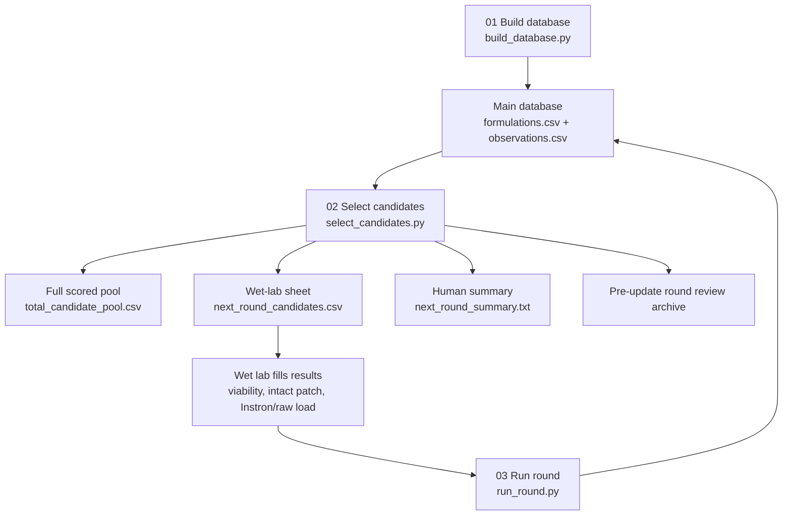

# CryoMN v2 Multi-Objective Workflow

This lane is intentionally separated from the legacy viability-only pipeline.
Only numbered directories contain executable workflow stages. Non-executable
implementation code lives in `helper/`.

## Main Database

The selector reads the v2 database from:

- `data/processed_v2/formulations.csv`
- `data/processed_v2/observations.csv`

Those are the only persistent model-state CSV files. Config remains in
`config_v2/`.

Legacy literature is read from `data/processed/parsed_formulations.csv` during
stage 01. Ingredients that cannot be acquired for this project, including
`cooh_pll`, `ficoll`, and `hes`, are not active v2 features. Literature
viability observations are assigned 10x the noise of legacy CryoMN wet-lab
validation observations.

Noise settings live in `config_v2/optimization.yaml`. Legacy literature
viability is `50.0`, legacy wet-lab viability is `5.0`, and new validation
viability feedback is `1.0` by default, meaning new results carry one fifth the
noise of legacy wet-lab results. For one-off imports, Stage 03 also accepts
`--viability-noise`.

Temporary ingredient availability is controlled by
`config_v2/availability.yaml`. These restrictions only affect stage 02 candidate
selection; they do not delete historical observations or change result imports.

## ROUND_002+ candidate-feasibility policy

The executed `ROUND_001` slate and all transferred records remain unchanged.
Beginning with candidate generation for `ROUND_002`, Stage 02 applies versioned
formulation guardrails, support-aware `40/35/25` screening generation,
uncertainty controls, and at most one support-boundary candidate per slate.

After the mechanics activation threshold, the workflow attempts continuous
constrained qLogNEHVI inside feasible sparse ingredient masks and falls back to
the constrained finite pool if BoTorch is unavailable or optimization fails.

See [Round 2 Candidate-Failure Prevention](../../docs/round2_candidate_failure_prevention.md)
for the failure analysis, evidence behind each limit, preparation-label
semantics, and optimizer details.

### Screening score and slate diversity controls

During `screening_only`, `screening_phase_score` is purely viability-based;
predicted intact-formation probability does not gate or score screening
candidates. Intact-formation risk is instead addressed by capped
`rescue_dilution` candidates (dilutions of high-viability formulations that
previously failed intact-patch formation) and, once `mechanics_enabled`, by
mechanics-phase scoring (`penalties.intact_failure_weight`,
`round_policy.intact_probability_threshold`).

Before the 12-row slate is finalized, Stage 02 applies two diversity
controls: an origin-quota that bounds how much any one candidate-origin
bucket (`local_perturbation`, `sparse_exploration`, `boundary_probe`,
`rescue_dilution`, `retest`, `continuous_qlognehvi`, `finite_pool_fallback`)
can contribute, and an ingredient-combination cap that limits how many
candidates may share the exact same active-ingredient set (pairs allowed up
to `selection.max_candidates_per_ingredient_combination`, default `3`;
3+-ingredient combinations capped at `selection.max_candidates_per_larger_ingredient_combination`,
default `1`). See [Stage 02](02_select_candidates/README.md#selection-logic)
for the full mechanism.

## Numbered Stages

| Stage | Purpose | Program |
|-------|---------|---------|
| 01 | Build the v2 database from legacy viability evidence. | [`01_build_database`](01_build_database/README.md) |
| 02 | Select the next wet-lab candidate set. | [`02_select_candidates`](02_select_candidates/README.md) |
| 03 | Archive one pre-update review of the current slate state, ingest wet-lab results, and generate the next slate. | [`03_run_round`](03_run_round/README.md) |

## Selector Outputs

Stage 02 writes:

- `results/multi_objective_v2/total_candidate_pool.csv`
- `results/multi_objective_v2/current_round_status.json`
- `results/multi_objective_v2/next_round/next_round_candidates.csv`
- `results/multi_objective_v2/next_round/next_round_summary.txt`
- `results/multi_objective_v2/next_round/next_round_metadata.json` for
  `ROUND_002+`

`total_candidate_pool.csv` is the full generated/scored pool after temporary
availability filtering. It includes model predictions, penalties, selection
scores, and flags showing which rows were promoted into the wet-lab slate.

`current_round_status.json` is a derived status file for operators. It records
the latest observed `ROUND_###`, the next proposed round ID, the active phase,
and whether the current proposal matches the next round implied by
`observations.csv`.

`next_round_candidates.csv` is the one detailed CSV. It contains the candidate
identity, formulation concentrations, model predictions, soft-constraint
diagnostics, mechanical-test recommendation flags, and blank wet-lab result
columns to fill. Those mechanical flags stay off until the selector reaches
`mechanics_enabled`.

`next_round_summary.txt` is the human-friendly validation sheet. Use it to see
the batch ID, which formulations to make, which rows are recommended for
Instron testing once mechanics is enabled, and what command to run after
results are filled.

`next_round_metadata.json` records the active policy version, activation round,
support radius, optimizer mode, fallback status, and detailed qLogNEHVI
diagnostics for reproducibility.

To lift the current temporary restriction on an ingredient, remove its
`feature_name` from `config_v2/availability.yaml` and rerun stage 02.

## Simple Loop

Initial start:

```bash
python3 src/08_multi_objective/01_build_database/build_database.py
python3 src/08_multi_objective/02_select_candidates/select_candidates.py
```

Later rounds:

```bash
python3 src/08_multi_objective/02_select_candidates/select_candidates.py
```

Supported round-progression entry point:

```bash
python3 src/08_multi_objective/03_run_round/run_round.py \
  results/multi_objective_v2/next_round/next_round_candidates.csv
```

The batch ID is generated as `ROUND_###` from `observations.csv`. After Stage 03
ingests `ROUND_001`, the next Stage 02 run emits `ROUND_002`. If you rerun Stage
02 before ingesting results, it will still emit the same next unused round ID.
`current_round_status.json` is regenerated alongside that process for redundant,
human-readable tracking.

## What To Fill In The CSV

Do not edit `formulation_id` or `candidate_id`.

| Column | Type / range | Notes |
|--------|--------------|-------|
| `batch_id` | string | Prefilled as `ROUND_###`; override with `--batch-id` if needed. |
| `replicate_id` | string | Optional. Use `rep_001`, `rep_002`, etc. Duplicate a row for technical replicates. |
| `viability_percent` | number, `0` to `100` | Post-thaw MSC viability. Blank means not measured. |
| `intact_patch_formation_pass` | boolean | `yes/no`, `true/false`, `pass/fail`, or `1/0`. |
| `no_slurry` | boolean | Optional formation-screen detail. |
| `no_collapse` | boolean | Optional formation-screen detail. |
| `intact_tip_count` | number | Optional; must be `0` to `total_tip_count`. |
| `total_tip_count` | positive number | Optional; blank uses the 100-tip default logic. |
| `instron_file` | path | Optional Bluehill CSV path for intact patches. |
| `needles_compressed` | positive integer | Required with `instron_file` or total critical load. |
| `critical_axial_load_N_per_needle` | number, `>= 0` | Use when entered manually. |
| `critical_axial_load_N_total` | number, `>= 0` | Program divides by `needles_compressed`. |
| `initial_stiffness_N_per_mm_per_needle` | number, `>= 0` | Secondary endpoint only. |
| `notes` | free text | Optional handling/test notes. |

## Instron Files

Put Bluehill CSV exports under `data/raw/instron/`, preferably grouped by batch:

```text
data/raw/instron/ROUND_001/v2_50b41683dfd4_rep_001.csv
```

You can either paste that path into `next_round_candidates.csv`, or let the
helper parse and fill the mechanical columns:

```bash
python3 src/08_multi_objective/helper/instron.py \
  data/raw/instron/ROUND_001/v2_50b41683dfd4_rep_001.csv \
  --formulation-id v2_50b41683dfd4 \
  --batch-id ROUND_001 \
  --replicate-id rep_001 \
  --needles-compressed 100
```

The normal output of `instron.py` is an updated
`next_round_candidates.csv`. The internal `observations.csv` is updated when
`03_run_round/run_round.py` ingests the filled round CSV.

## ID Meanings

- `formulation_id`: stable chemistry identity generated from canonical
  ingredient concentrations.
- `candidate_id`: row identity within one generated candidate set.
- `batch_id`: wet-lab round identity, generated as `ROUND_###` unless
  overridden.
- `replicate_id`: technical replicate identity within one batch/formulation.

## Workflow Chart


