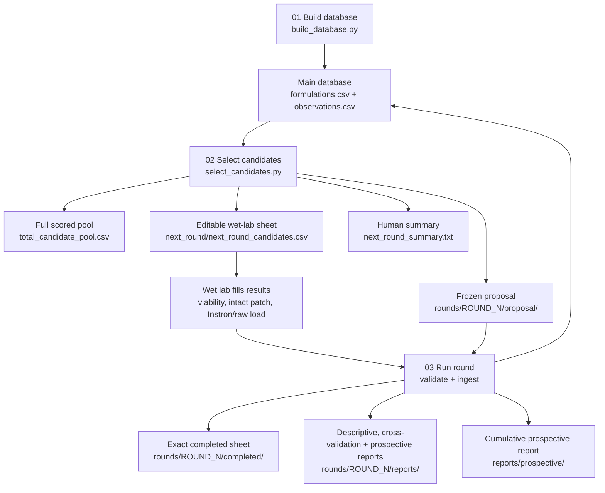

# CryoMN v2 Multi-Objective Workflow

This lane is intentionally separated from the legacy viability-only pipeline.
Only numbered directories contain executable workflow stages. Non-executable
implementation code lives in `helper/`.

## Main Database

The selector reads the v2 database from:

- `data/processed_v2/formulations.csv`
- `data/processed_v2/observations.csv`

Those are the only persistent model-state CSV files. Config remains in
`config_v2/`.

Legacy literature is read from `data/processed/parsed_formulations.csv` during
stage 01. Ingredients that cannot be acquired for this project, including
`cooh_pll`, `ficoll`, and `hes`, are not active v2 features. Literature
viability observations are assigned 10x the noise of legacy CryoMN wet-lab
campaign validation observations.

Noise settings live in `config_v2/optimization.yaml`. Legacy literature
viability is `50.0`, legacy wet-lab viability is `5.0`, and campaign validation
viability feedback is `1.0` by default, meaning campaign results carry one fifth the
noise of legacy wet-lab results. For one-off imports, Stage 03 also accepts
`--viability-noise`.

Ingredient availability is controlled by
`config_v2/availability.yaml`. These restrictions only affect stage 02 candidate
selection; they do not delete stored observations or change result imports.

## ROUND_002+ candidate-feasibility policy

The executed `ROUND_001` slate and all transferred records remain unchanged.
Candidate generation for `ROUND_002` and higher applies versioned
formulation guardrails, support-aware `40/35/25` screening generation,
uncertainty controls, and at most one support-boundary candidate per slate.
Here, the boundary cap applies to rows whose measured support classification is
`support_status=boundary`; it does not cap how many feasible candidates were
generated by the `candidate_origin=boundary_probe` stream.

After the mechanics activation threshold, the workflow attempts continuous
constrained qLogNEHVI inside feasible sparse ingredient masks and falls back to
the constrained finite pool if BoTorch is unavailable or optimization fails.

See [Round 2 Candidate-Failure Prevention](../../docs/round2_candidate_failure_prevention.md)
for the failure analysis, evidence behind each limit, preparation-label
semantics, and optimizer details.

## ROUND_005+ solubility and viscosity policy

Round 5 activates `round5_solubility_viscosity_v2`. It adds registry-backed
individual practical ceilings, unconditional permeating-CPA, sugar and
nonpermeating-solute totals, a crystalline-solute saturation burden, corrected
raffinose-pentahydrate preparation mass. Availability suppresses sampling only.
The policy schedule and limits are defined in `config_v2/optimization.yaml`;
ingredient evidence and practical ceilings are defined in
`config_v2/ingredients.yaml`.

## ROUND_003+ formulation-similarity policy

Round 3 introduces one unified history-and-pool similarity gate without
changing the 12-row slate size or its origin-allocation rules. After practical
trace concentrations are treated as zero, candidates must be more than `0.05`
apart in Euclidean distance across the complete registry-bounds-normalized
formulation vector. When both formulations contain the same single active
ingredient, they must also differ by at least 50% relative to the lower
concentration.

The similarity reference set contains only unique formulations with actual
`legacy_wetlab` or `wetlab_feedback` observations; literature-only rows are
excluded. Accepted candidates are also compared with one another during pool
generation. Rescue dilutions are subject to the rule, while intentional
`retest_priority` rows are exempt. The generator rejects and resamples instead
of post-filtering a fixed pool, preserving the configured 40/35/25 origin
targets where feasible. `ROUND_001` and `ROUND_002` do not use this policy.

### Screening score and slate diversity controls

Through Round 5, screening did not use the additive intact classifier. From
Round 6, `screening_phase_score` is min-max-normalized viability UCB minus
chemistry penalties, support penalty, and a bounded exact-combination empirical
intact deduction. The viability GP and `StandardScaler` are unchanged. The
classifier remains a reported prospective diagnostic and cannot alter active
screening selection.

Before the 12-row slate is finalized, Stage 02 applies the ROUND_003+
similarity gate plus four slate-level diversity controls: an origin-quota that
bounds how much any one candidate-origin
bucket (`local_perturbation`, `sparse_exploration`, `boundary_probe`,
`rescue_dilution`, `retest`, `continuous_qlognehvi`, `finite_pool_fallback`)
can contribute, and an ingredient-combination cap that limits how many
candidates may share the exact same active-ingredient set (pairs allowed up
to `selection.max_candidates_per_ingredient_combination`, default `2`;
3+-ingredient combinations capped at `selection.max_candidates_per_larger_ingredient_combination`,
default `1`). A shared-core-pair rule counts every unordered ingredient
pair inside every non-retest row, even when extra ingredients are present, and
permits at most five rows containing the same pair. Rescue rows count toward
the limit; intentional retests do not. Finally, a marginal-frequency cap
allows each registry ingredient in at most five of all 12 rows. Retests and
rescues count toward this marginal limit but are protected from removal;
ordinary replacements must come from the same candidate origin. See
[Stage 02](02_select_candidates/README.md#selection-logic) for the full
mechanism.

## ROUND_006+ intact and cold-start policy

Round 6 activates `round6_empirical_combination_intact_v1` and
`round6_cold_start_graduation_v1`. Both are forward-only: completed observations
and frozen Rounds 1-5 remain immutable.

The intact policy aggregates prior campaign technical replicates per
formulation/batch with the all-pass rule, matches only identical complete active
ingredient sets, and uses registry-range-normalized RMS distance. Within radius
`0.35`, evidence weight is `max(0,1-distance/0.35)`. With weighted passes `P`
and failures `F`, `p_combo=(1+P)/(2+P+F)`. Unseen active sets therefore start at
`0.50`. Screening deducts at most `0.20` and only when `p_combo<0.50`; failures
are never assigned to an individual ingredient, subset, or superset.

An ingredient is cold-start below three distinct prior campaign formulation IDs
with measured viability. Each cold ingredient is independently capped at two
ordinary rows; a multi-cold row consumes a slot under every applicable cap.
Retests and rescue dilutions are exempt, though their completed viability can
contribute to later graduation. Up to four ordinary positions target
graduation, one per cold ingredient first, in closest-to-three,
least-recently-tested, registry order. Remaining positions may provide a second
distinct active set. All availability, feasibility, support, similarity,
combination, pair, universal-frequency, and origin-allocation rules remain hard.

## Evidence-gated mechanics transition

`mechanics_transition_v1` resolves the proposal phase from completed screening
and paired mechanical evidence. The proposal round label is recorded for audit,
but it does not satisfy an evidence gate. Manual `--phase-mode` values bypass
automatic resolution for audit or debugging and are marked as overrides in
metadata.

| Phase | Automatic entry condition | Screening slate | Mechanical allocation |
|---|---|---:|---:|
| `screening_only` | Fewer than 8 completed screening rounds | 12 | None |
| `mechanics_bootstrap` | Screening entry met; hybrid 8/6/2 gate not met | 12 | Four diversity-oriented tests |
| `mechanics_hybrid` | At least 8 paired observations, 6 distinct paired formulations, and 2 paired batches; full gate not met | 12 | Two qLogNEHVI, one local, one coverage |
| `mechanics_enabled` | At least 16 paired observations, 12 distinct paired formulations, and 3 paired batches | 12 | Four full mechanics primaries plus ordered backups |

A completed screening round is a `ROUND_###` batch containing measured
`viability_percent` and `intact_patch_formation_pass` endpoints. A paired
mechanical observation is one formulation–batch training row containing both
`viability_percent` and `critical_axial_load_N_per_needle` under the same
`batch_id`. Technical replicates are aggregated before gate counts, so they do
not create additional formulation–batch pairs. Repeating a formulation in a
later batch creates another pair without overwriting its earlier evidence.

The resolver evaluates conditions in this order:

1. Keep `screening_only` until the screening-entry requirement is met.
2. Use `mechanics_bootstrap` while the 8/6/2 hybrid gate is incomplete.
3. Use `mechanics_hybrid` after the hybrid gate and while the 16/12/3 full gate
   is incomplete.
4. Use `mechanics_enabled` after the full gate is satisfied.

### Changing the transition policy

No campaign round is hard-coded as a mechanics phase. With the default
`minimum_completed_screening_rounds: 8`, completion of `ROUND_001` through
`ROUND_008` makes the following proposal eligible for bootstrap; that proposal
will ordinarily be `ROUND_009`. If the minimum is set to `10`, the first
bootstrap-eligible proposal will ordinarily follow ten completed screening
rounds instead.

Edit only the `mechanics_transition` block in
`config_v2/optimization.yaml` for future automatic proposals:

```yaml
mechanics_transition:
  entry:
    minimum_completed_screening_rounds: 8
  hybrid_gate:
    min_paired_observations: 8
    min_distinct_formulations: 6
    min_batches: 2
  full_gate:
    min_paired_observations: 16
    min_distinct_formulations: 12
    min_batches: 3
```

All three values within an evidence gate are joined by **AND**. Raising or
lowering one value changes only that requirement; the other two must still be
satisfied. Keep `phase_mode: auto` for normal operation. The CLI phase choices
are temporary audit/debug overrides and do not rewrite the configured gates.

The same configuration block controls mechanical capacity, bootstrap score
weights, anchor timing and repeat limit, hybrid slate weights, hybrid slot
allocation, coverage floors, and repeat exclusions. When changing hybrid slot
counts, keep their sum equal to the configured mechanical capacity unless a
deliberately underfilled allocation is intended.

Configuration changes apply when a future proposal is generated. Do not edit
or regenerate a started or completed proposal to apply a different gate. After
selection, verify `current_round_status.json`, `next_round_summary.txt`, and
`next_round_metadata.json`; each reports the resolved phase, gate counts,
requirements, remaining deficits, and override status.

Every phase retains the 12-row viability/intact slate and its feasibility,
support, formulation-similarity, ingredient-combination, shared-pair,
marginal-frequency, cold-start, rescue, and evidence-based retest rules.
Mechanical rank is a separate eligibility layer; an unranked screening row
cannot provide mechanical data or serve as a mechanical backup.

### Bootstrap selection

Ordinary bootstrap eligibility excludes `retest_priority` rows and any
formulation with a prior critical-load observation. For each eligible slate
row:

```text
bootstrap utility =
  0.70 × minmax(screening_phase_score)
  + 0.30 × empirical_combination_pass_probability
```

The first fresh primary maximizes bootstrap utility. Remaining fresh primaries
and backups are selected greedily with composition diversity:

```text
bootstrap rank score =
  0.60 × minmax(bootstrap utility)
  + 0.40 × minmax(distance to nearest selected formulation)
```

Distance is Euclidean distance over the complete formulation vector after each
ingredient is scaled by its registry bounds. The first fresh row is labeled
`bootstrap_utility`; later fresh rows are labeled `bootstrap_coverage`.
Bootstrap does not invoke qLogNEHVI.

The second mechanically active bootstrap batch may contain one
`mechanics_anchor` and three fresh primaries. The anchor is drawn only from the
immediately preceding mechanical batch and must have same-batch viability,
critical load, and an actual intact pass. Technical replicates are aggregated
before scoring. The score is:

```text
anchor score =
  0.50 × minmax(observed mean viability)
  + 0.50 × minmax(observed mean critical load)
```

Ties use lower viability replicate SD and then formulation ID. The formulation
must remain chemically feasible, use available ingredients, and have no
recorded preparation failure. The anchor receives mechanical rank 1,
`recommendation_type=mechanics_anchor`, `candidate_origin=mechanics_anchor`,
and transition role `anchor`. Its wet-lab fields are blank because viability,
intact formation, and load must all be measured again. No other mechanically
observed formulation can enter the slate for mechanical testing. If no anchor
qualifies, the batch contains four fresh primaries and metadata records the
reason. Automatic selection permits no more than one exact anchor repeat and
does not schedule it in another bootstrap batch.

### Hybrid selection

Hybrid mode trains the mechanical surrogate, attempts continuous qLogNEHVI
generation, preserves `candidate_origin` values such as
`local_perturbation`, and computes the empirical-feasibility-weighted mechanics
score. The 12-row slate score is:

```text
hybrid_phase_score =
  0.50 × minmax(screening_phase_score)
  + 0.50 × minmax(mechanics_phase_score)
```

Four mechanically untested, non-retest primaries are allocated in this order:

1. the highest feasibility-weighted mechanics score;
2. a second high mechanics score chosen by the established diversity-aware
   picker;
3. the highest-scoring unused `local_perturbation` row;
4. the maximum-distance coverage row relative to prior mechanical observations
   and the first three selections.

The coverage row must be in the upper half of the slate's screening scores,
have empirical intact probability at least `0.50`, have no prior critical-load
observation, and satisfy the slate's feasibility and diversity constraints. A
missing local or coverage role is filled deterministically by the highest
unused hybrid score. Metadata retains the requested role, fallback reason, and
candidate used. Remaining mechanically eligible rows are ordered backups by
mechanics score.

### Full mechanics selection

`mechanics_enabled` retains continuous qLogNEHVI generation when BoTorch is
available and reports optimization failures before falling back to the finite
pool. Viability and critical axial load per needle are the two Pareto
objectives; initial stiffness remains diagnostic. Empirical intact probability
is feasibility, not a third objective:

```text
BoTorch constrained log acquisition =
  qLogNEHVI + log(max(p_combo, 1e-9))

finite-pool fallback =
  log1p(raw hypervolume-like improvement × p_combo)
```

The first four mechanically eligible rows are primaries and the remaining
eligible rows are ordered backups. Exact mechanically observed formulations
and `retest_priority` rows are unranked. An explicit confirmation policy would
be required to allow any repeat beyond the one bootstrap anchor.

### Actual-intact execution and shortfalls

Stage 03 considers only rows with a numeric `mechanical_selection_rank`.
Operators fabricate and screen all 12 rows, then test the first four ranked rows
that actually pass intact. Failed or blank-intact rows are skipped, and backups
are promoted strictly in ascending mechanical rank. Mechanical fields on an
unranked, failed-intact, blank-intact, out-of-order, or over-capacity row cause
validation to fail. If fewer than four ranked rows pass intact, test every
ranked passing row and leave the remaining capacity unused; the completion
manifest records the shortfall.

The anchor follows the same rule and must be remeasured rather than carrying
forward values from its source batch. A mechanical result is ingested under the
proposal batch ID, preserving one training row per formulation–batch after
technical-replicate aggregation.

### Worksheet, metadata, and operator contract

The proposal and total pool expose:

- `mechanical_transition_role`
- `prior_mechanical_observation_count`
- `mechanical_repeat_status`
- `mechanical_repeat_allowed`

Transition roles are `anchor`, `bootstrap_utility`, `bootstrap_coverage`,
`hybrid_qlognehvi`, `hybrid_local`, `hybrid_coverage`, `ordered_backup`, or
blank for a mechanically ineligible row. Full-mechanics primaries use a blank
transition role because the workflow is no longer transitioning; their numeric
rank and `mechanical_backup_status=primary` define execution priority.

Proposal metadata, the operator summary, current status, and the mechanical
execution manifest report the resolved phase and reason, both gate counts and
requirements, override status, bootstrap batch index, transition roles,
anchor decision and source batch, repeat/retest exclusions, hybrid quota
fallbacks, qLogNEHVI availability and errors, actual-intact promotions, and
test shortfalls. Operators fill only editable preparation, viability, intact,
Instron/load, replicate, and note fields. Candidate identity, composition,
ranks, roles, model diagnostics, and policy metadata remain unchanged.

### Round 3 uncertainty and retest policy

Round 3 uses a Matérn 2.5 regression kernel with per-observation
`alpha` values as the sole GP noise mechanism. A fixed normalized
`WhiteKernel(5.0)` is not used. Proposal metadata records the minimum, median
and maximum candidate-pool uncertainty, while prospective reports show
prediction-interval width alongside coverage.

Round 7 adds forward-only evidence-aware viability labels. Unsupported
cold-start and prior-reverted surrogate outputs are shown to operators as
unknown instead of as the pooled GP mean. Raw surrogate mean/SD columns remain
frozen in the proposal for acquisition provenance and prospective evaluation;
the public prediction columns are blank for unknown candidates.

Automatic retests use campaign `wetlab_feedback` only. A formulation is
eligible for at most two available slate slots when feedback batches disagree
by at least 15 percentage points, the highest-numbered batch has at least three
replicates with sample SD at least 8 points, or a single feedback batch is at
least 20 points off its bounds-normalized chemical neighbours and has not yet
received its one anomaly-confirmation batch. Model uncertainty never creates
eligibility; it only breaks ties. Once two batches agree within 15 points and
the highest-numbered-batch replicate SD is below 8, the neighbour residual cannot request a
third test.

## Numbered Stages

| Stage | Purpose | Program |
|-------|---------|---------|
| 01 | Build the v2 database from legacy viability evidence. | [`01_build_database`](01_build_database/README.md) |
| 02 | Select the next wet-lab candidate set and freeze its proposal artifacts. | [`02_select_candidates`](02_select_candidates/README.md) |
| 03 | Validate and archive the completed worksheet, ingest results, generate round reports, and roll over to the next slate. | [`03_run_round`](03_run_round/README.md) |
| 04 | Regenerate read-only round or cumulative prospective reports on demand. | [`04_report_campaign`](04_report_campaign/README.md) |

## Selector Outputs

Stage 02 writes:

- `results/multi_objective_v2/total_candidate_pool.csv`
- `results/multi_objective_v2/current_round_status.json`
- `results/multi_objective_v2/next_round/next_round_candidates.csv`
- `results/multi_objective_v2/next_round/next_round_summary.txt`
- `results/multi_objective_v2/next_round/next_round_metadata.json` for
  `ROUND_002+`
- `results/multi_objective_v2/rounds/ROUND_###/proposal/proposal.csv`
- `results/multi_objective_v2/rounds/ROUND_###/proposal/summary.txt`
- `results/multi_objective_v2/rounds/ROUND_###/proposal/selection_metadata.json`
  when metadata is available
- `results/multi_objective_v2/rounds/ROUND_###/proposal/plots/next_round_candidate_screen.png`

`total_candidate_pool.csv` is the full generated/scored pool after temporary
availability filtering. It includes model predictions, penalties, selection
scores, and flags showing which rows were promoted into the wet-lab slate.

`current_round_status.json` is a derived status file for operators. It records
the highest observed `ROUND_###`, proposed round ID, phase resolution and
evidence gates, proposed transition roles, optimizer fallback information, and
whether the proposal matches the round implied by `observations.csv`.

`next_round_candidates.csv` is the one detailed CSV. It contains the candidate
identity, formulation concentrations, model predictions, soft-constraint
diagnostics, mechanical-test recommendation flags, and blank wet-lab result
columns to fill. Only numeric-ranked rows are eligible for mechanics in
bootstrap, hybrid, or full mechanics phases.

`next_round_summary.txt` is the human-friendly validation sheet. Use it to see
the batch ID, which formulations to make, which rows are recommended for
Instron testing once mechanics is enabled, and what command to run after
results are filled.

`next_round_metadata.json` records transition-policy version, phase evidence,
anchor and repeat decisions, hybrid quota fulfillment, support radius,
optimizer mode, fallback status, and qLogNEHVI diagnostics for reproducibility.

## Round-Scoped Artifacts

`results/multi_objective_v2/next_round/` is the active operator workspace.
Only `next_round/next_round_candidates.csv` is edited during a wet-lab round.

Each round also has a read-only-by-convention archive:

```text
results/multi_objective_v2/rounds/ROUND_###/
├── proposal/     # Exact pre-bench slate, selection metadata, summary and plot
├── completed/    # Exact successfully ingested worksheet bytes
└── reports/      # Reports generated from the database after this round's ingest
```

Do not edit files under `rounds/`. Stage 03 validates the working worksheet
against `proposal/proposal.csv`: result, replicate and note fields may change;
candidate identity, chemistry, predictions, uncertainties, ranks and selection
diagnostics may not. Row reordering and duplicated rows for technical
replicates are allowed, but all proposed candidates must remain present.

The top-level `results/multi_objective_v2/reports/` directory is reserved for
cumulative campaign reports. Proposal-time prospective reports are stored
under `reports/prospective/`. The top-level `total_candidate_pool.csv` is a
mutable full debug pool and is overwritten on each selection run.

`model_evaluation_overview.png` and
`model_evaluation_table.csv` are formulation-grouped cross-validation
diagnostics: all batches of one chemistry remain in the same fold. They fit
from the database contents and estimate within-dataset generalization. They are
not prospective hold-out results. Completed-round descriptive reports first
aggregate technical replicates to one candidate row. Continuous endpoints use
the replicate mean; the intact-patch gate passes only when every measured patch
replicate passes. Prospective evaluation reads means and uncertainties only
from frozen proposal CSVs, then compares them with matching observations without
retraining. Its round summaries report formulations observed, passed and failed
explicitly. Round 1 is reconstructed, Round 2 is
supplementary because it was migration-frozen, and the locked primary metric
is pooled viability MAE for the formal Round 3+ cohort. Interval coverage is
always accompanied by interval width.

To lift a temporary restriction on an ingredient, remove its
`feature_name` from `config_v2/availability.yaml` and rerun stage 02.

## Simple Loop

Initial start:

```bash
python3 src/08_multi_objective/01_build_database/build_database.py
python3 src/08_multi_objective/02_select_candidates/select_candidates.py
```

Supported round-progression entry point:

```bash
python3 src/08_multi_objective/03_run_round/run_round.py \
  results/multi_objective_v2/next_round/next_round_candidates.csv
```

For every normal iteration, fill the active worksheet and run Stage 03 once.
Do not run Stage 02 separately: Stage 03 performs validation, ingestion,
archival, descriptive/cross-validation reporting, prospective reporting and
then invokes Stage 02 to freeze the next round. Stage 01 is initial setup only.

The batch ID is generated as `ROUND_###` from `observations.csv`.
`current_round_status.json` is regenerated alongside selection for redundant,
human-readable tracking. An identical selector rerun leaves the frozen
proposal unchanged; Stage 02 refuses to replace a different proposal for the
same round.

## What To Fill In The CSV

Fill only
`results/multi_objective_v2/next_round/next_round_candidates.csv`. Do not edit
archived proposal or completed files, and do not edit `formulation_id` or
`candidate_id`.

| Column | Type / range | Notes |
|--------|--------------|-------|
| `batch_id` | string | Prefilled as `ROUND_###`; override with `--batch-id` if needed. |
| `replicate_id` | string | Optional. Use `rep_001`, `rep_002`, etc. Duplicate a row for technical replicates. |
| `viability_percent` | number, `0` to `100` | Post-thaw MSC viability. Blank means not measured. |
| `intact_patch_formation_pass` | boolean | `yes/no`, `true/false`, `pass/fail`, or `1/0`. |
| `no_slurry` | boolean | Optional formation-screen detail. |
| `no_collapse` | boolean | Optional formation-screen detail. |
| `intact_tip_count` | number | Optional; must be `0` to `total_tip_count`. |
| `total_tip_count` | positive number | Optional; blank uses the 100-tip default logic. |
| `instron_file` | path | Optional Bluehill CSV path for intact patches. |
| `needles_compressed` | positive integer | Required with `instron_file` or total critical load. |
| `critical_axial_load_N_per_needle` | number, `>= 0` | Use when entered manually. |
| `critical_axial_load_N_total` | number, `>= 0` | Program divides by `needles_compressed`. |
| `initial_stiffness_N_per_mm_per_needle` | number, `>= 0` | Secondary endpoint only. |
| `notes` | free text | Optional handling/test notes. |

## Instron Files

Put Bluehill CSV exports under `data/raw/instron/`, preferably grouped by batch:

```text
data/raw/instron/ROUND_001/v2_50b41683dfd4_rep_001.csv
```

You can either paste that path into `next_round_candidates.csv`, or let the
helper parse and fill the mechanical columns:

```bash
python3 src/08_multi_objective/helper/instron.py \
  data/raw/instron/ROUND_001/v2_50b41683dfd4_rep_001.csv \
  --formulation-id v2_50b41683dfd4 \
  --batch-id ROUND_001 \
  --replicate-id rep_001 \
  --needles-compressed 100
```

The normal output of `instron.py` is an updated
`next_round_candidates.csv`. The internal `observations.csv` is updated when
`03_run_round/run_round.py` ingests the filled round CSV.

## ID Meanings

- `formulation_id`: stable chemistry identity generated from canonical
  ingredient concentrations.
- `candidate_id`: row identity within one generated candidate set.
- `batch_id`: wet-lab round identity, generated as `ROUND_###` unless
  overridden.
- `replicate_id`: technical replicate identity within one batch/formulation.

## Workflow Chart


```mermaid
flowchart TD
    A["01 Build database<br/>build_database.py"] --> B["Main database<br/>formulations.csv + observations.csv"]
    B --> C["02 Select candidates<br/>select_candidates.py"]
    C --> P["Full scored pool<br/>total_candidate_pool.csv"]
    C --> Q["Frozen proposal<br/>rounds/ROUND_N/proposal/"]
    C --> D["Editable wet-lab sheet<br/>next_round/next_round_candidates.csv"]
    C --> E["Human summary<br/>next_round_summary.txt"]
    D --> F["Wet lab fills results<br/>viability, intact patch, Instron/raw load"]
    F --> G["03 Run round<br/>validate + ingest"]
    Q --> G
    G --> H["Exact completed sheet<br/>rounds/ROUND_N/completed/"]
    G --> I["Descriptive, cross-validation + prospective reports<br/>rounds/ROUND_N/reports/"]
    G --> J["Cumulative prospective report<br/>reports/prospective/"]
    G --> B
```
